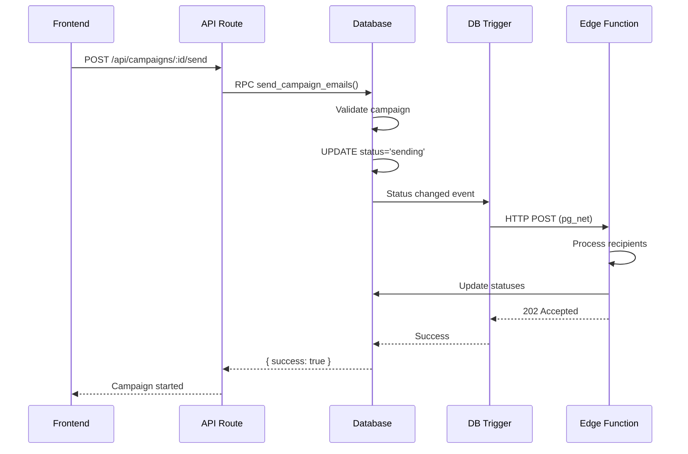

# Email Campaign Trigger System

Automatic email campaign processing system that triggers Supabase Edge Functions when campaign status changes to "sending".

## 📋 Table of Contents

- [Overview](#overview)
- [Architecture](#architecture)
- [Quick Start](#quick-start)
- [Files](#files)
- [How It Works](#how-it-works)
- [API Reference](#api-reference)
- [Troubleshooting](#troubleshooting)

## Overview

This system provides an automated way to process email campaigns by:

1. **Database Trigger**: Automatically detects when a campaign status changes to "sending"
2. **Edge Function Invocation**: Calls the email worker edge function via HTTP
3. **Campaign Processing**: Worker processes all pending recipients in the background
4. **Status Updates**: Real-time updates to campaign and recipient statuses

### Key Features

✅ **Automatic Processing**: No manual edge function invocation needed  
✅ **Retry Logic**: Built-in exponential backoff for failed emails  
✅ **Real-time Progress**: Track campaign progress with live stats  
✅ **Campaign Control**: Pause, resume, retry, and cancel campaigns  
✅ **Multiple Accounts**: Support for multiple Microsoft email accounts  
✅ **Error Handling**: Graceful error handling with detailed logging  

## Architecture

```
┌─────────────────────────────────────────────────────────────────┐
│                         Frontend (Next.js)                      │
│  ┌──────────────────────────────────────────────────────────┐   │
│  │  Campaign Actions UI                                     │   │
│  │  • Start  • Pause  • Resume  • Retry  • Cancel          │   │
│  └──────────────────────────────────────────────────────────┘   │
└────────────────────┬────────────────────────────────────────────┘
                     │
                     │ HTTP POST /api/campaigns/[id]/send
                     ↓
┌─────────────────────────────────────────────────────────────────┐
│                    API Routes (Next.js)                         │
│  • /api/campaigns/[id]/send     → send_campaign_emails()       │
│  • /api/campaigns/[id]/pause    → pause_campaign()             │
│  • /api/campaigns/[id]/retry    → retry_failed_recipients()    │
│  • /api/campaigns/[id]/cancel   → cancel_campaign()            │
│  • /api/campaigns/[id]/status   → get_campaign_progress()      │
└────────────────────┬────────────────────────────────────────────┘
                     │
                     │ Supabase RPC call
                     ↓
┌─────────────────────────────────────────────────────────────────┐
│                  Database Functions (PostgreSQL)                │
│  ┌──────────────────────────────────────────────────────────┐   │
│  │  send_campaign_emails(campaign_id)                       │   │
│  │    • Validates campaign                                  │   │
│  │    • Updates status to 'sending'  ────┐                 │   │
│  └───────────────────────────────────────┼─────────────────┘   │
│                                           │                     │
│  ┌───────────────────────────────────────┼─────────────────┐   │
│  │  Database Trigger                     │                 │   │
│  │    trigger_campaign_email_worker()    │                 │   │
│  │                                       │                 │   │
│  │    WHEN status = 'sending'  <─────────┘                 │   │
│  │    THEN invoke edge function via HTTP (pg_net)          │   │
│  └──────────────────────┬───────────────────────────────────┘   │
└─────────────────────────┼───────────────────────────────────────┘
                          │
                          │ HTTP POST (pg_net)
                          ↓
┌─────────────────────────────────────────────────────────────────┐
│            Edge Function: send-email-worker (Deno)              │
│  ┌──────────────────────────────────────────────────────────┐   │
│  │  1. Fetch campaign & recipients                          │   │
│  │  2. Get/refresh Microsoft access token                   │   │
│  │  3. For each recipient:                                  │   │
│  │     • Send email via Microsoft Graph API                 │   │
│  │     • Update recipient status (sent/failed)              │   │
│  │     • Log events                                         │   │
│  │     • Handle retries with exponential backoff            │   │
│  │  4. Update campaign status when complete                 │   │
│  └──────────────────────────────────────────────────────────┘   │
└─────────────────────────────────────────────────────────────────┘
```

## Quick Start

### 1. Run the Migration

Execute the migration in your Supabase SQL Editor:

```bash
# Copy and paste docs/database/migrations/001_email_campaign_trigger_setup.sql
```

### 2. Enable pg_net Extension

In Supabase Dashboard:
- Go to **Database** → **Extensions**
- Enable **pg_net**

### 3. Configure Database Settings

Run in SQL Editor:

```sql
-- Set your Supabase project URL
ALTER DATABASE postgres SET app.settings.project_url TO 
  'https://your-project-ref.supabase.co';

-- Set your service role key (found in Dashboard → Settings → API)
ALTER DATABASE postgres SET app.settings.service_role_key TO 
  'your-service-role-key-here';
```

### 4. Deploy Edge Function

```bash
supabase functions deploy send-email-worker
```

### 5. Set Edge Function Secrets

```bash
supabase secrets set MICROSOFT_CLIENT_ID=xxx
supabase secrets set MICROSOFT_CLIENT_SECRET=xxx
supabase secrets set SUPABASE_URL=https://your-project-ref.supabase.co
supabase secrets set SUPABASE_SERVICE_ROLE_KEY=xxx
```

### 6. Test It!

```typescript
// In your frontend
const response = await fetch(`/api/campaigns/${campaignId}/send`, {
  method: 'POST'
});

// That's it! The trigger handles the rest automatically
```

## Files

### Migration Files

| File | Description |
|------|-------------|
| **001_email_campaign_trigger_setup.sql** | Main migration that creates triggers and functions |
| **SETUP.md** | Detailed setup instructions and configuration |
| **API_INTEGRATION.md** | Frontend integration guide with code examples |
| **README.md** | This file - overview and quick reference |

### API Routes

| Route | Method | Description |
|-------|--------|-------------|
| `/api/campaigns/[id]/send` | POST | Start sending a campaign |
| `/api/campaigns/[id]/pause` | POST | Pause an active campaign |
| `/api/campaigns/[id]/retry` | POST | Retry failed recipients |
| `/api/campaigns/[id]/cancel` | POST | Cancel a campaign |
| `/api/campaigns/[id]/status` | GET | Get campaign progress |

### Database Functions

| Function | Purpose |
|----------|---------|
| `send_campaign_emails(campaign_id)` | Validates and starts campaign |
| `pause_campaign(campaign_id)` | Pauses active campaign |
| `retry_failed_recipients(campaign_id)` | Retries failed sends |
| `cancel_campaign(campaign_id)` | Cancels campaign |
| `get_campaign_progress(campaign_id)` | Returns detailed progress |
| `trigger_campaign_email_worker()` | Trigger function (internal) |

## How It Works

### Starting a Campaign



### Campaign Lifecycle

```
┌────────────┐
│   DRAFT    │  Initial state
└─────┬──────┘
      │ send_campaign_emails()
      ↓
┌────────────┐
│  SENDING   │  ← Trigger fires here! 🔥
└─────┬──────┘    Invokes edge function
      │
      ├─── All successful ───→ ┌────────┐
      │                         │  SENT  │
      │                         └────────┘
      │
      ├─── pause_campaign() ──→ ┌─────────┐
      │                          │ PAUSED  │
      │                          └─────────┘
      │
      └─── cancel_campaign() ─→ ┌───────────┐
                                 │ CANCELLED │
                                 └───────────┘
```

## API Reference

### Send Campaign

**Endpoint**: `POST /api/campaigns/[id]/send`

**Request**:
```typescript
// No body required
```

**Response**:
```json
{
  "success": true,
  "message": "Campaign started successfully",
  "campaign_id": "uuid",
  "total_recipients": 150,
  "sending_from": "user@example.com"
}
```

**Frontend Usage**:
```typescript
import { useCampaignActions } from '@/hooks/use-campaign-actions';

const { sendCampaign } = useCampaignActions();
await sendCampaign(campaignId);
```

### Pause Campaign

**Endpoint**: `POST /api/campaigns/[id]/pause`

**Response**:
```json
{
  "success": true,
  "message": "Campaign paused successfully",
  "campaign_id": "uuid"
}
```

### Retry Failed Recipients

**Endpoint**: `POST /api/campaigns/[id]/retry`

**Response**:
```json
{
  "success": true,
  "message": "Queued 5 recipients for retry",
  "recipients_queued": 5
}
```

### Cancel Campaign

**Endpoint**: `POST /api/campaigns/[id]/cancel`

**Response**:
```json
{
  "success": true,
  "message": "Campaign cancelled successfully",
  "campaign_id": "uuid",
  "cancelled_recipients": 10
}
```

### Get Campaign Progress

**Endpoint**: `GET /api/campaigns/[id]/status`

**Response**:
```json
{
  "campaign": {
    "id": "uuid",
    "name": "Q4 Newsletter",
    "status": "sending",
    "total_recipients": 100,
    "sent_count": 75,
    "delivered_count": 72,
    "failed_count": 3,
    "progress": 75,
    "delivery_rate": 96
  },
  "stats": {
    "pending": 22,
    "sending": 3,
    "sent": 75,
    "delivered": 72,
    "failed": 3,
    "bounced": 0
  },
  "recent_recipients": [...],
  "recent_events": [...]
}
```

## Troubleshooting

### Common Issues

#### 1. "Edge function not configured properly"

**Symptoms**: Warning in PostgreSQL logs  
**Solution**: Set database configuration settings

```sql
ALTER DATABASE postgres SET app.settings.project_url TO 
  'https://your-project-ref.supabase.co';
ALTER DATABASE postgres SET app.settings.service_role_key TO 
  'your-service-role-key';
```

#### 2. Trigger not firing

**Check**:
```sql
-- Verify trigger exists
SELECT 
  trigger_name,
  event_manipulation,
  event_object_table,
  action_statement
FROM information_schema.triggers
WHERE trigger_name = 'invoke_email_worker_on_status_change';
```

**Solution**: Re-run the migration

#### 3. Edge function not receiving requests

**Check edge function logs**:
```bash
supabase functions logs send-email-worker --tail
```

**Verify pg_net requests**:
```sql
SELECT * FROM net._http_response 
ORDER BY created DESC 
LIMIT 10;
```

#### 4. "No valid Microsoft account"

**Symptoms**: Campaign fails to start  
**Solution**: Ensure user has connected a Microsoft account and `user_token_id` is set on the campaign

#### 5. Emails not sending

**Check recipient statuses**:
```sql
SELECT status, COUNT(*) 
FROM campaign_recipients 
WHERE campaign_id = 'your-campaign-id'
GROUP BY status;
```

**Check for errors**:
```sql
SELECT recipient_email, error_message, retry_count
FROM campaign_recipients
WHERE campaign_id = 'your-campaign-id'
AND status = 'failed';
```

### Debug Mode

Enable verbose logging in PostgreSQL:

```sql
-- Set log level
ALTER DATABASE postgres SET log_min_messages TO 'notice';

-- View logs
SELECT * FROM postgres_logs ORDER BY timestamp DESC LIMIT 100;
```

### Testing the Trigger

```sql
-- Create a test campaign
INSERT INTO email_campaigns (user_id, subject, body, status)
VALUES (auth.uid(), 'Test Campaign', 'Test body', 'draft')
RETURNING id;

-- Update status to trigger the worker
UPDATE email_campaigns 
SET status = 'sending' 
WHERE id = 'your-test-campaign-id';

-- Check PostgreSQL logs for trigger execution
```

### Manual Edge Function Invocation (for testing)

```bash
curl -X POST \
  'https://your-project-ref.supabase.co/functions/v1/send-email-worker' \
  -H "Authorization: Bearer ${SUPABASE_SERVICE_ROLE_KEY}" \
  -H "Content-Type: application/json" \
  -d '{"campaign_id": "your-campaign-id"}'
```

## Performance Considerations

### Rate Limiting

- **Microsoft Graph API**: ~30 requests/second per user
- **Edge Function**: 1-second delay between emails (adjustable)
- **Concurrent Campaigns**: Multiple campaigns can run simultaneously

### Scaling

- **Small campaigns** (< 100 recipients): ~2-3 minutes
- **Medium campaigns** (100-1000 recipients): ~15-20 minutes
- **Large campaigns** (1000+ recipients): ~1 hour+

### Optimization Tips

1. **Batch processing**: Edge function processes all recipients in one invocation
2. **Connection pooling**: Database connections are reused
3. **Token caching**: Access tokens are refreshed only when needed
4. **Parallel campaigns**: Multiple users can send campaigns simultaneously

## Security

### Service Role Key Storage

- ✅ Stored in database configuration (secure)
- ✅ Only accessible to database functions
- ✅ Never exposed to client-side code
- ✅ Used only by triggers with SECURITY DEFINER

### Row-Level Security (RLS)

All helper functions verify:
- User is authenticated (`auth.uid()`)
- User owns the campaign (`user_id = auth.uid()`)
- Campaign is not deleted (`deleted_at IS NULL`)

### Access Control

```sql
-- All functions check ownership
CREATE POLICY "Users can only manage their own campaigns"
ON email_campaigns
USING (user_id = auth.uid());
```

## Monitoring

### Campaign Dashboard Query

```sql
SELECT 
  id,
  name,
  status,
  total_recipients,
  sent_count,
  ROUND((sent_count::NUMERIC / NULLIF(total_recipients, 0)) * 100, 2) as progress_percent,
  started_at,
  completed_at
FROM email_campaigns
WHERE user_id = auth.uid()
AND status IN ('sending', 'sent', 'paused')
ORDER BY started_at DESC;
```

### Failed Sends Report

```sql
SELECT 
  c.name as campaign,
  cr.recipient_email,
  cr.error_message,
  cr.retry_count,
  cr.updated_at
FROM campaign_recipients cr
JOIN email_campaigns c ON cr.campaign_id = c.id
WHERE c.user_id = auth.uid()
AND cr.status = 'failed'
ORDER BY cr.updated_at DESC
LIMIT 50;
```

### System Health Check

```sql
-- Active campaigns
SELECT COUNT(*) as active_campaigns
FROM email_campaigns
WHERE status = 'sending';

-- Recent pg_net requests
SELECT COUNT(*) as recent_requests
FROM net._http_response
WHERE created > NOW() - INTERVAL '1 hour';

-- Average send rate
SELECT 
  AVG(total_recipients / EXTRACT(EPOCH FROM (completed_at - started_at))) as emails_per_second
FROM email_campaigns
WHERE status = 'sent'
AND completed_at IS NOT NULL
AND started_at IS NOT NULL;
```

## Next Steps

1. ✅ Run the migration
2. ✅ Configure database settings
3. ✅ Deploy edge function
4. ✅ Test with a small campaign
5. ✅ Monitor logs during first test
6. ✅ Scale to production

## Support & Resources

- **Setup Guide**: [SETUP.md](./SETUP.md)
- **API Integration**: [API_INTEGRATION.md](./API_INTEGRATION.md)
- **Supabase Docs**: https://supabase.com/docs
- **PostgreSQL Triggers**: https://www.postgresql.org/docs/current/trigger-definition.html
- **pg_net Extension**: https://github.com/supabase/pg_net

---

**Last Updated**: October 29, 2025  
**Version**: 1.0.0  
**Status**: ✅ Production Ready

